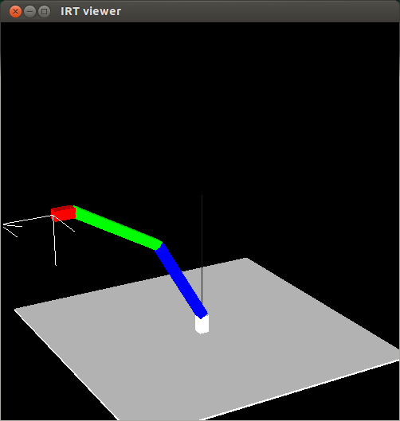
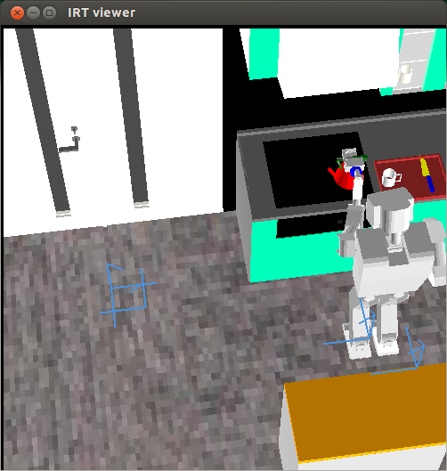
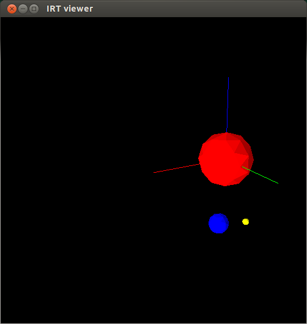
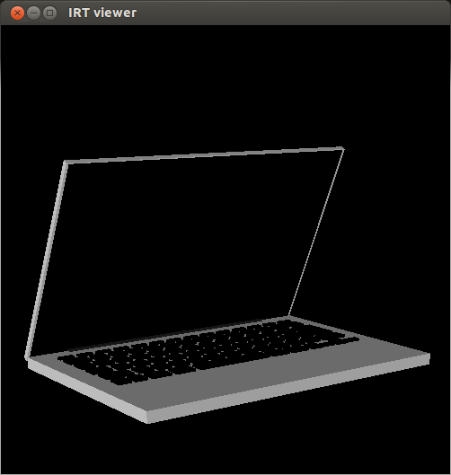

Euslisp examples
===

```bash
$ irteusgl 1-2-2.l
```

Model samples
===
```bash
$ irteusgl 1.3.3.l
```


```bash
$ irteusgl robot.l
```


```bash
$ irteusgl kadai1.l
```


```bash
$ irteusgl kadai3-wkentaro.l
```

